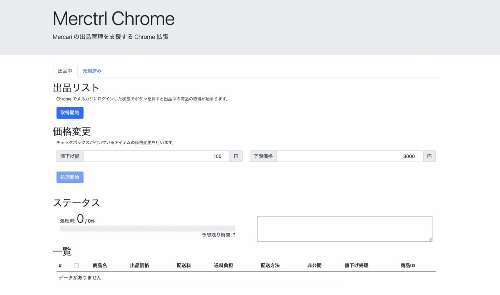
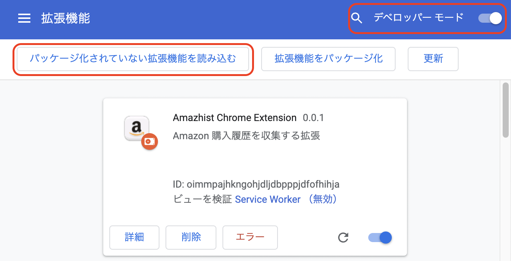

# merctrl_chrome

merctrl_chrome は，メルカリの出品情報を管理する Chrome 拡張です．次の機能を提供します．

- 出品しているアイテムの値下げ
- 出品しているアイテム一覧の CSV 保存
- 売却済みのアイテムの CSV 保存

## インストール

### Github から

1. Github からソース一式をダウンロード．

2. Chrome の「拡張機能」タブでディベロッパーモードを有効化．

3. 「パッケージ化されていない拡張機能を読み込む」で，merctrl_chrome の **src ディレクトリ** を指定．

## 使い方

アドレスバーの右側にある Merctrl Chrome Extension のアイコンをクリックします．(拡張機能が沢山ある場合は，アドレスバーの右側のジグゾーパズルのようなアイコンをクリックすると，現れると思います)

## TODO

- 出品中の商品の値下げを行う機能の追加
